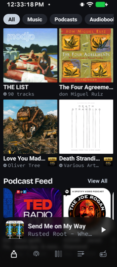
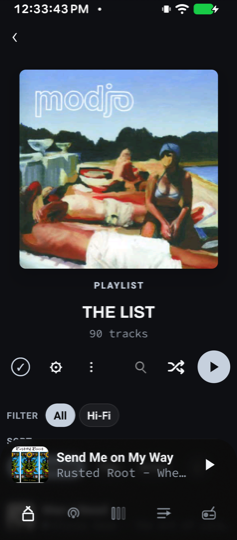
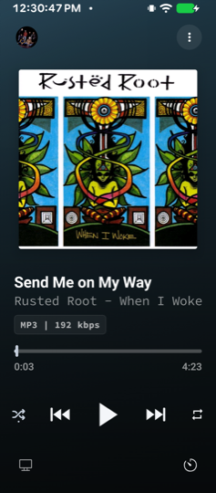
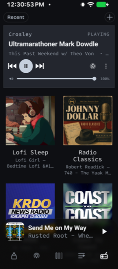
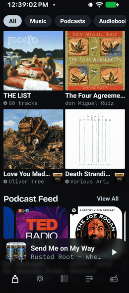

# samo

A self-hosted listening client for music, audiobooks, podcasts and radio — one
library, one queue, one history, on Android and on the desktop.

samo is the client half of a pair. The server half is
[samo-server](https://github.com/bouliehaan/samo-server), a native media server
where the four media kinds are first-class domains that share playback state,
recents and browsing — not stapled together in the client.

| Home | Playlist | Now playing | Radio |
|:----:|:--------:|:-----------:|:-----:|
|  |  |  |  |

## Install

Grab a build from **[Releases](https://github.com/bouliehaan/samo/releases/latest)**.
You need a [samo-server](https://github.com/bouliehaan/samo-server) on your
network — the app finds it by itself on first run.

Unlike the rest of the samo repos, this one is not a container. It is an app you
install on a device.

**Android** — `Samo-<version>-android.apk`. Sideload it; your phone will ask you
to allow installs from whatever you downloaded it with.

**macOS** — `Samo-<version>-mac-arm64.dmg` (Apple silicon) or `-mac-x64.dmg`
(Intel). The build is ad-hoc signed and not notarised, so Gatekeeper will call
it damaged. Clear the quarantine flag after dragging it to Applications:

```bash
xattr -dr com.apple.quarantine /Applications/Samo.app
```

**Windows and Linux** — no published build yet. Build one yourself:
`pnpm run package:win` / `pnpm run package:linux`.

## Status

Honest state of things, so nobody installs this expecting a finished product:

| Part | State |
|------|-------|
| **Android app** | The most actively developed surface. Native ExoPlayer engine, offline downloads, Chromecast, on-device catalog mirror. |
| **Desktop (Electron)** | samo-only, single API controller. Works, gets less attention. |
| **`@samo/core`** | Shared server client, playback and media-detail mapping, covered by tests. |

A personal project developed in the open. No stability promise and no migration
guarantee between versions.

## Building it yourself

Node 20+ and [pnpm](https://pnpm.io). For Android, JDK 17 and the Android SDK —
Android Studio's bundled JDK works, the `android` scripts point at it.

```bash
pnpm install
pnpm dev                              # desktop, in development
pnpm run package:mac                  # package for the current platform

cd apps/android && pnpm run android   # debug build onto a connected device
cd apps/android && pnpm run android:release   # release APK
```

Gates, all of which should be green before a change lands:

```bash
pnpm run lint                            # typecheck + ESLint + Stylelint
pnpm test
cd apps/android && pnpm run verify       # typecheck + lint for Android
```

## Layout

```
src/            Desktop app (Electron: main, preload, renderer, shared)
apps/android/   Android app (React Native + Expo, bare workflow)
packages/core/  @samo/core — server client and media mapping shared by both
```

Both clients talk to the same `@samo/core`, so server behaviour is defined once
and they inherit it together.

## Design notes

Entrances are staged rather than uniform — the heavy element leads and the
lighter ones attached to it lag, then catch up.

<p align="center">
  
</p>

- [`docs/MOTION_PRINCIPLES.md`](docs/MOTION_PRINCIPLES.md) — Disney's twelve principles, how each maps to a screen, and where each lives in the code.
- [`docs/ANDROID_ARCHITECTURE_STATUS.md`](docs/ANDROID_ARCHITECTURE_STATUS.md) — module stores, module-function handlers, self-subscribing hosts.
- [`docs/PERFORMANCE_AND_NETWORK.md`](docs/PERFORMANCE_AND_NETWORK.md) — where the app spends time and what it does about it.
- [`docs/NAMING.md`](docs/NAMING.md) — the name is `samo`, lowercase, everywhere a person reads it.

## Credits

samo began as a fork of **[Feishin](https://github.com/jeffvli/feishin)** by
[Jeff Vialpando (jeffvli)](https://github.com/jeffvli), and would not exist
without it. The desktop app still carries a great deal of Feishin's architecture
and code.

Bundled typefaces: **Bricolage Grotesque** (SIL OFL 1.1,
[licence](assets/fonts/BricolageGrotesque-OFL.txt)), **Archivo**, **Office Code
Pro**.

## Licence

[GPL-3.0-only](LICENSE), inherited from Feishin.
